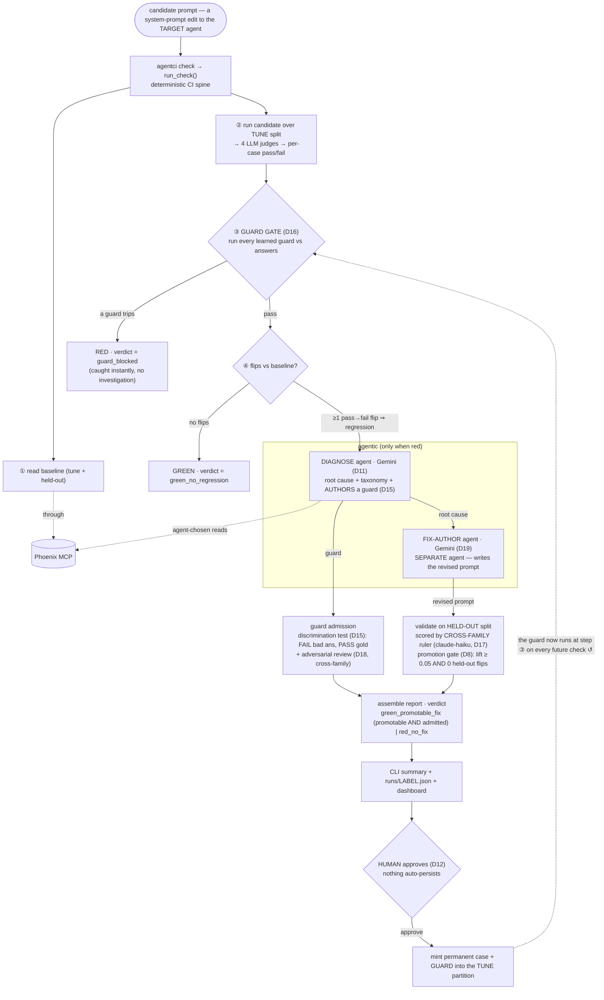

# AgentCI — system diagram (current)

> The engine as it stands after **Plan 06** (compounding regression immunity, D15–D19) and
> **Plan 07** (surface). Traced from `run_check()` in `agentci/engineer/__init__.py`.

A candidate is a system-prompt edit to the **target** support agent. AgentCI runs it, detects
regressions, and when the gate goes red an investigator agent diagnoses the failure, authors a
guard, and a separate agent proposes a fix that must prove held-out lift on a cross-family ruler.
A human approves; the fix is promoted and the guard joins the permanent suite — so the next run
checks for that exact regression up front.

## Flow



## ASCII fallback

```
   candidate prompt  (a system-prompt edit to the TARGET support agent)
          │
          ▼
   agentci check ─►  run_check()        — deterministic CI spine
          │
  ① read baseline (tune + held-out) ───through──► Phoenix MCP   ◀─ 2 MCP reads
          │
  ② run candidate over TUNE split ─► 4 LLM judges ─► per-case pass/fail
          │
  ③ GUARD GATE (D16) — run every previously-learned guard vs the answers
          ├──[ a guard trips ]──────────────►  RED · verdict = guard_blocked  ✋ stop
          │
  ④ flips vs baseline?
          ├──[ no flips ]───────────────────►  GREEN · verdict = green_no_regression
          └──[ ≥1 pass→fail flip ⇒ regression ]──┐  go agentic
                                                 ▼
        ┌───────────────────────────────┐   ┌───────────────────────────────┐
        │  DIAGNOSE agent (Gemini, D11)  │   │ FIX-AUTHOR agent (Gemini, D19) │
        │   • root cause + taxonomy      │   │  SEPARATE agent — writes the   │
        │   • headline wrong-vs-right    │   │  revised target prompt         │
        │   • AUTHORS a guard (D15)      │   └───────────────┬───────────────┘
        └───────────────┬───────────────┘                   │ revised prompt
                        │ guard                              ▼
                        ▼                        validate on HELD-OUT split,
            guard admission                       scored by a CROSS-FAMILY ruler
            • discrimination test (D15):           (claude-haiku, D17 — the agent
              FAIL the bad answer, PASS gold         can't grade its own homework)
            • adversarial review (D18,                        │
              cross-family) for rubric guards     promotion gate (D8):
                        │                          lift ≥ 0.05  AND  0 held-out flips
                        └──────────────────┬──────────────────┘
                                           ▼
                                   assemble report
                 verdict = green_promotable_fix  (promotable AND guard admitted)
                            or  red_no_fix
                                           │
                                           ▼
                    CLI summary  +  runs/<label>.json  +  dashboard
                                           │
                                           ▼
                       HUMAN approves (D12)   ✋ nothing auto-persists
                                           │
                                           ▼
            mint permanent case + GUARD into the TUNE partition
                                           │
                                           └──► grows the eval suite ↺
                                                (the guard now runs at step ③
                                                 on every future check)
```

## Verdicts

| verdict | gate | when |
|---|---|---|
| `guard_blocked` | red | a candidate trips a previously-learned guard (step ③) — instant, no investigation |
| `green_no_regression` | green | no tune-set pass→fail flips |
| `green_promotable_fix` | green | regression found, fix proves held-out lift, and the authored guard was admitted |
| `red_no_fix` | red | regression found but no promotable fix |

> The interactive, clickable version of this diagram lives in [`architecture.html`](../architecture.html).
